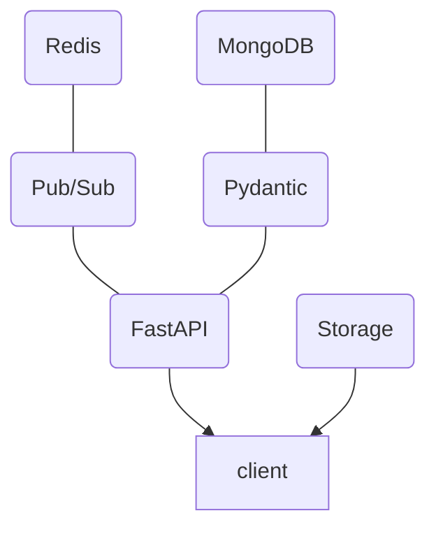
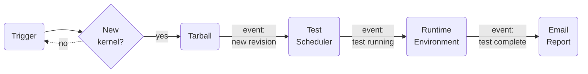

## API architecture

The main building blocks of the API are put together this way:



The `client` component can be a number of things.  Each pipeline step is a
client, and there could be extra standalone ones too.  They interact via the
API and the storage services separately.  By default, storage is provided by
SSH for uploads and HTTP for downloads for standalone deployments using
`docker-compose`.  Production deployments may use alternative solutions as
long as all the binaries are accessible via direct HTTP URLs.

## Why a new API?

The new KernelCI API is a complete redesign to replace the legacy
[backend](https://api.kernelci.org/) used in production, which has several
limitations.  In particular, the [**previous backend
API**](https://github.com/kernelci/kernelci-backend):

* was written in Python 2.7, which has now reached end-of-life
* has a monolithic design with many built-in features (regression tracking,
  email reports, parsing test results directly from LAVA labs...)
* uses Celery for asynchronous request handling, whereas modern Python can do
  this natively
* has no pub/sub mechanism, orchestration relies on an external framework
  (i.e. Jenkins)

To overcome these limitations, the **new API** has the following
characteristics:

* based on [FastAPI](https://fastapi.tiangolo.com/) to provide native
  asynchronous request handling, data model validation using
  [Pydantic](https://pydantic-docs.helpmanual.io/), automatically generated
  documentation with [OpenAPI](https://www.openapis.org/).  See also the
  [OpenAPI JSON
  description](https://staging.kernelci.org:9000/latest/openapi.json).
* Pub/Sub mechanism via the API, with [Redis](https://redis.io/) to manage
  message queues.  This can now be used to coordinate client-side functions and
  recreate a full modular pipeline with no additional framework
* [CloudEvent](https://cloudevents.io/) for the formatting of Pub/Sub events
* is written for [Python 3.10](https://www.python.org/downloads/release/python-3100/)
* relies on [JWT](https://jwt.io/) and [OAuth 2.0](https://oauth.net/2/)
  authentication for inter-operability with other services
* treats storage entirely separately from the API which purely handles data.
  Several storage solutions can be supported, such as SSH for self-contained
  systems, AzureFiles, and S3 for Cloud deployments etc.

A few things **aren't changing**:

* [MongoDB](https://www.mongodb.com/) has been used with the first backend for
  several years and is providing good results.  We might just move it to a
  Cloud-based hosting such as Atlas for the future linux.kernelci.org
  deployment.
* [Redis](https://redis.io/) is still being used internally as in-memory
  database for various features in addition to the pub/sub channels

## Pipeline design

Here's a simplified view of the current pipeline:



Each step is a client for the API and related storage solutions.  They are all
implemented in Python, rely on the [KernelCI Core](/docs/legacy/core) tools and run in a separate `docker-compose` container.  Here's a summary of each step:

### Trigger

The Trigger step periodically checks whether a new kernel revision has appeared
on a number of git branches.  It first gets the revision checksum (SHA-1) from
the top of the branch from the remote git repo and then queries the API to
check whether it has already been covered.  If there's no revision entry with
this checksum in the API, it then pushes a new `checkout` one with "running"
state.

### Tarball

The Tarball step listens for pub/sub events about new revisions or `checkout`
nodes.  When one is received, typically because the trigger pushed a new one to
the API, it then updates a local git checkout of the full kernel source tree.
Then it makes a tarball with the source code and pushes it to the storage.
Finally, it sends an update to the `checkout` node to the API with the URL of
the tarball added to the list of artifacts and the status set to "available".

### Scheduler

The Scheduler step listens for a variety of pub/sub events and then looks for
matches in the `scheduler` [YAML
configuration](https://github.com/kernelci/kernelci-pipeline/blob/main/config/pipeline.yaml#L144).
Every time an event matches an entry in the config, it will send a new node
with the "running" state to the API and submit a job in the designated runtime
environment.

> **Note**: It's then up to the job itself to send the results to the API and
> any files to storage.  The scheduler doesn't track the status of submitted
> jobs, however the system's timeout feature will update the status of nodes
> that reach their timeout value.

### Runtime Environment

Jobs are all the concrete parts of the actual pipeline payload: preparing some
source files, running static checks, building the kernel, running functional
tests on real hardware, checking regressions, post-processing the test results
etc.  They get run in Runtime environments.

Runtime environments could be anything that can run a job.  Currently, it can
be a local shell, a local Docker container, a
[Kubernetes](https://kubernetes.io/) cluster or a
[LAVA](https://www.lavasoftware.org/) lab.  Additional Runtime implementations
could be on-demand [VMs in GCE](https://cloud.google.com/compute),
[LabGrid](https://www.pengutronix.de/en/software/labgrid.html) and maybe SSH.
It's of course possible to create custom ones for particular use-cases.

### Email Report

The current implementation for email reports is very minimalist.  This pipeline
step just listens for events about kernel revisions being done, then sends an
email to a fixed recipient with the top-level results and details about any
test failures.  Here's an example (you'll notice a few inconsistencies, work in
progress...):

```
[STAGING] mainline/master v6.5-11329-g708283abf896: 4 runs 0 failures

Summary
=======

Tree:     mainline
Branch:   master
Describe: v6.5-11329-g708283abf896
URL:      https://git.kernel.org/pub/scm/linux/kernel/git/torvalds/linux.git
SHA1:     708283abf896dd4853e673cc8cba70acaf9bf4ea

Name              | Result   | Total    | Failures
------------------+----------+----------+---------
kver              | pass     |        0 |        0
kbuild-gcc-10-x86 | pass     |        5 |        0
kunit             | None     |        0 |        0
kunit-x86_64      | pass     |      104 |        2


Failing tests
=============

kunit-x86_64
------------

* exec.example.example_skip_test # SKIP this test should be skipped
* exec.example.example_mark_skipped_test # SKIP this test should be skipped
```
