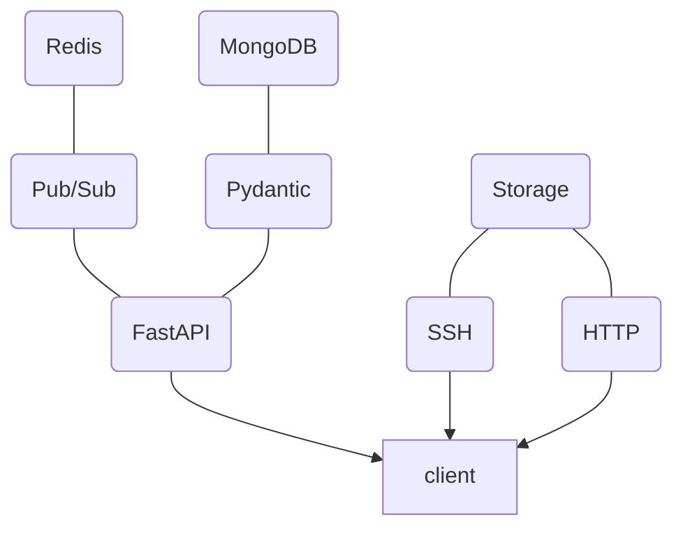
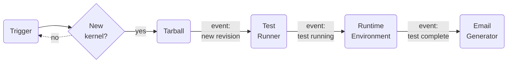

## API architecture

The main building blocks of the API are put together this way:



The `client` component can be a number of things.  Each service in the pipeline
is a client, and there could be extra standalone ones too.  They interact via
the API and the storage services separately.  By default, storage is provided
by SSH for uploads and HTTP for downloads.  Production deployments may use
alternative solutions, as long as all the binaries are accessible via direct
HTTP URLs.

## Why a new API?

The new KernelCI API is a work-in-progress to replace the current
[backend](https://api.kernelci.org/) used in production, which has several
limitations.  In particular, the [**previous backend
API**](https://github.com/kernelci/kernelci-backend):

* was written in Python 2.7, which has now reached end-of-life
* has a monolithic design with many built-in features (regression tracking,
  email reports, parsing test results directly from LAVA labs...)
* uses Celery for asynchronous request handling, whereas modern Python can do
  this natively
* has no pub/sub mechanism, orchestration relies on an external framework
  (i.e. Jenkins)

To overcome these limitations, the **new API** has the following
characteristics:

* based on [FastAPI](https://fastapi.tiangolo.com/) to provide native
  asynchronous request handling, data model validation using
  [Pydantic](https://pydantic-docs.helpmanual.io/), automatically generated
  documentation with [OpenAPI](https://www.openapis.org/).  See also the
  [OpenAPI JSON description](https://staging.kernelci.org:9000/openapi.json).
* Pub/Sub mechanism via the API, with [Redis](https://redis.io/) to manage
  message queues.  This can now be used to coordinate client-side functions and
  recreate a full modular pipeline with no additional framework
* [CloudEvent](https://cloudevents.io/) for the formatting of Pub/Sub events
* is written for [Python 3.10](https://www.python.org/downloads/release/python-3100/)
* relies on [JWT](https://jwt.io/) authentication for inter-operability with
  other services
* treats storage entirely separately from the API which purely handles data.
  An initial storage solution is provided using SSH for sending files and HTTP
  for serving them.

A few things **aren't changing**:

* [MongoDB](https://www.mongodb.com/) has been used with the first backend for
  several years and is providing good results.  We might just move it to a
  Cloud-based hosting such as Atlas for the future linux.kernelci.org
  deployment.
* [Redis]((https://redis.io/)) is still being used internally as in-memory
  database for various features in addition to the pub/sub channels

## Pipeline design

The pipeline currently has the following steps:



Each step is a client for the API and associated storage.  Apart from the
runtime environment, They are all implemented in Python, rely on the [KernelCI
Core](/docs/core) tools and run in a separate `docker-compose` container.
Here's a summary of each step:

### Trigger

The Trigger step periodically checks whether a new kernel revision has appeared
on a git branch.  It first gets the revision checksum from the top of the
branch from the git repo and then queries the API to check whether it has
already been covered.  If there's no revision entry with this checksum in the
API, it then pushes one with "available" state.

### Tarball

The Tarball step listens for pub/sub events about new revisions.  When one is
received, typically because the trigger pushed a new revision to the API, it
then updates a local git checkout of the full kernel source tree.  Then it
makes a tarball with the source code and pushes it to the storage.  Finally,
the URL of the tarball is added to the revision data, the status is set to
"complete" and an update is sent to the API.

### Test Runner

The Runner step listens for pub/sub events about completed revisions, typically
following the tarball step.  It will then schedule some tests to be run in
various runtime environments as defined in the pipeline YAML configuration from
the Core tools.  A node entry is sent to the API for each test submitted with
"running" state.  It's then up to the test in the runtime environment to send
its results to the API and set the final status.

### Runtime Environment

This could be anything from a local shell (currently the only supported one),
to Kubernetes, LAVA or any arbitrary system.  Tests can be any actual work
scheduled by the Runner step such as building a kernel, running some test,
performing some static analysis etc.  Each environment needs to have its own
API token set up locally to be able to submit the results.

### Email Report

The Email Report in its current status listens for events once a build and its revisions'
tests are completed and renders an email message using a jinja template. In the rendered
message you can see relevant information about a build or revision. When the message is ready
the application opens a connection to an STMP server and sends the report to a user or a list of
recipients that are waiting for the report with the build information after executing tests and
possible regressions. With the report, it is possible to see the number of tests that have failed or passed,
as seen in the example below:

```
testing/master v5.18-rc4-31-g2a987e65025e: 5 runs 3 fails (check-describe)

Tests Summary
-------------

Build details:

Tree:     testing
Branch:   master
Describe: v5.18-rc4-31-g2a987e65025e
URL:      https://git.kernel.org/pub/scm/linux/kernel/git/torvalds/linux.git
SHA1:     babf0bb978e3c9fce6c4eba6b744c8754fd43d8e


Revision details:

test           | result
---------------+-------
check-describe | fail
check-describe | fail
check-describe | pass
check-describe | pass
check-describe | fail
```
