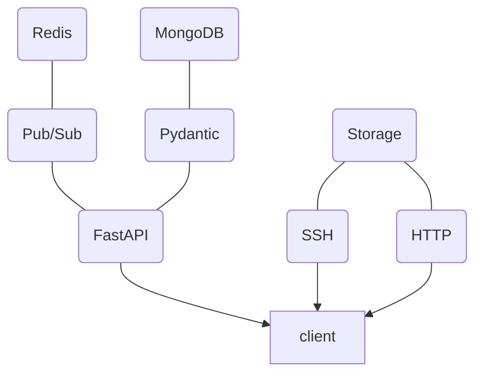

The main building blocks of the API are put together this way:

The `client` component can be a number of things.  Each service in the pipeline
is a client, and there could be extra standalone ones too.  They interact via
the API and the storage services separately.  By default, storage is provided
by SSH for uploads and HTTP for downloads.  Production deployments may use
alternative solutions, as long as all the binaries are accessible via direct
HTTP URLs.

## Why a new API?

The new KernelCI API is a work-in-progress to replace the current
[backend](https://api.kernelci.org/) used in production, which has several
limitations.  In particular:

* Written in Python 2.7, which has now reached end-of-life
* Monolithic design with many built-in features (regression tracking, email
  reports, parsing test results directly from LAVA labs...)
* Asynchronous request handling is done using Celery, whereas modern Python can
  do this natively
* No pub/sub mechanism, orchestration relies on an external framework
  (i.e. Jenkins)

To overcome these limitations, the new API has the following characteristics:

* Based on FastAPI to provide native asynchronous request handling, data model
  validation using Pydantic, automatically generated documentation with
  [OpenAPI](https://www.openapis.org/).  See also the [OpenAPI JSON
  description](https://staging.kernelci.org:9000/openapi.json).
* Pub/SUb mechanism via the API, with Redis to manage message queues.  This can
  now be used to coordinate client-side functions and recreate a full modular
  pipeline with no additional framework
* CloudEvent for the formatting of Pub/Sub events
* Written for Python 3.10
* Authentication based on JWT for inter-operability with other services
* Storage is entirely separate from the API as it purely handles data.  An
  initial storage solution is provided using SSH for sending files and HTTP for
  serving them.

A few things aren't changing:

* MongoDB has been used with the first backend for several years and is
  providing good results.  We might just move it to a Cloud-based hosting such
  as Atlas for the future linux.kernelci.org deployment.
* Redis is still being used internally as in-memory database for various
  features in addition to the pub/sub channels
