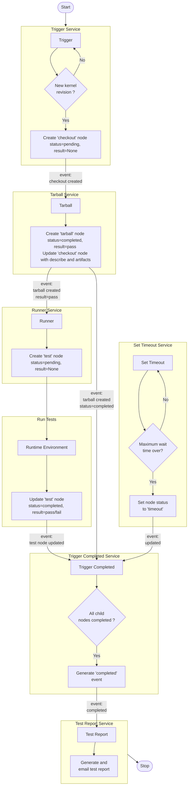

## Pipeline detailed design

Below is the detailed pipeline flow diagram with associated node and pub/sub event:

Here's a description of each client script:

### Trigger

The pipeline starts with the trigger script.
The Trigger periodically checks whether a new kernel revision has appeared
on a git branch.  If so, it firsts checks if API has already created a node with
the record. If not, it then pushes one node named "checkout". The node's status will be "pending" and the result is not defined yet. This will generate pub/sub event of node creation.

### Tarball

When the trigger pushes new revision node (checkout), the tarball receives a pub/sub event, and it then updates a local git checkout of the full kernel source tree.  Then it makes a tarball with the source code and pushes it to the API storage. A node named 'tarball' is pushed with the 'completed' status and result (pass/fail). The URL of the tarball is also added to the artifacts of the revision node.

### Runner

The Runner step listens for pub/sub events about completed tarball node with result "pass".  It will then schedule some tests to be run in
various runtime environments as defined in the pipeline YAML configuration from
the Core tools.  A test node is pushed to the API with "pending" state e.g. "check-describe" node. This will generate pub/sub event of test node creation.

### Runtime Environment

The tests added by runner will be run in specified runtime environment i.e. shell, Kubernetes or LAVA lab.
Each environment needs to have its own API token set up locally to be able to submit the results to API. It updates test node with status "completed" and result (pass or fail). This will generate pub/sub event of test node update.

### Trigger Completed

The trigger completed service typically listens to node creation and update events. It triggers a "completed" event when all child nodes of a parent node are in "completed" or "timeout" state. This event is used to generate test reports.

### Set Timeout

The set timeout service periodically checks all nodes' status. If a child node is in "pending" state, then it checks whether the maximum wait time is over. If so, it sets the node status to "timeout". This will generate pub/sub event of node update.

### Test Report

The Test Report in its current status listens for completed events. It then generates a test report with the child nodes' details of a completed parent node and sends the report over an email.
