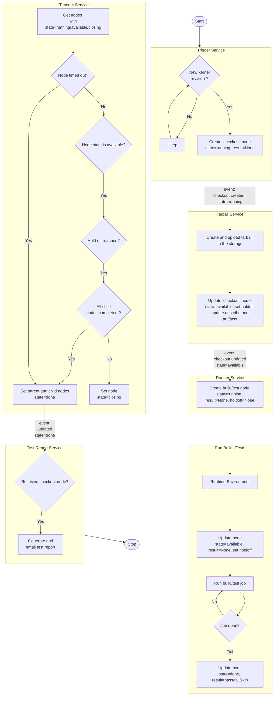

## Pipeline detailed design

Below is the detailed pipeline flow diagram with associated node and pub/sub event:

Here's a description of each client script:

### Trigger

The pipeline starts with the trigger script.
The Trigger periodically checks whether a new kernel revision has appeared
on a git branch.  If so, it firsts checks if API has already created a node with
the record. If not, it then pushes one node named "checkout". The node's state will be "available" and the result is not defined yet. This will generate pub/sub event of node creation.

### Tarball

When the trigger pushes a new revision node (checkout), the tarball receives a pub/sub event. The tarball then updates a local git checkout of the full kernel source tree.  Then it makes a tarball with the source code and pushes it to the API storage. The state of the checkout node will be updated to 'available' and the holdoff time will be set. The URL of the tarball is also added to the artifacts of the revision node.

### Runner

The Runner step listens for pub/sub events about available checkout node.  It will then schedule some jobs (it can be any kind of job including build and test) to be run in various runtime environments as defined in the pipeline YAML configuration from the Core tools. A node is pushed to the API with "available" state e.g. "kunit" node. This will generate pub/sub event of build or test node creation.

### Runtime Environment

The jobs added by runner will be run in specified runtime environment i.e. shell, Kubernetes or LAVA lab.
Each environment needs to have its own API token set up locally to be able to submit the results to API. It updates the node with state "done" and result (pass, fail, or skip). This will generate pub/sub event of node update.

### Timeout

The timeout service periodically checks all nodes' state. If a node is not in "done" state, then it checks whether the maximum wait time (timeout) is over. If so, it sets the node and all its child nodes to "done" state.
If the node is in "available" state and not timed-out, it will check for holdoff time. If the holdoff reached, and all its child nodes are completed, the node state will be moved to "done", otherwise the state will be set to "closing".
The parent node with "closing" state can not have any new child nodes.
This will generate pub/sub event of node update.

### Test Report

The Test Report in its current state listens for completed checkout node. It then generates a test report along with the child nodes' details and sends the report over an email.
